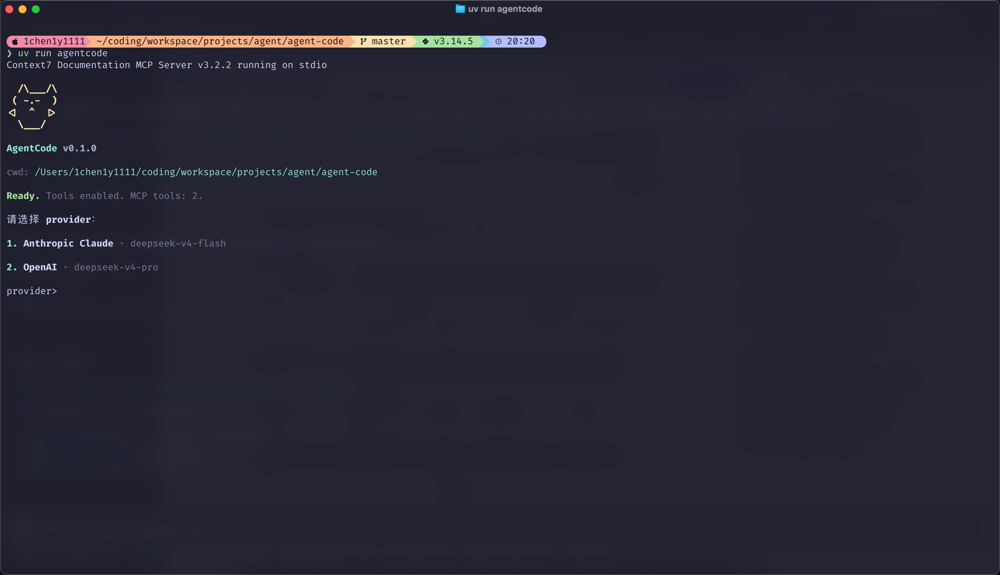
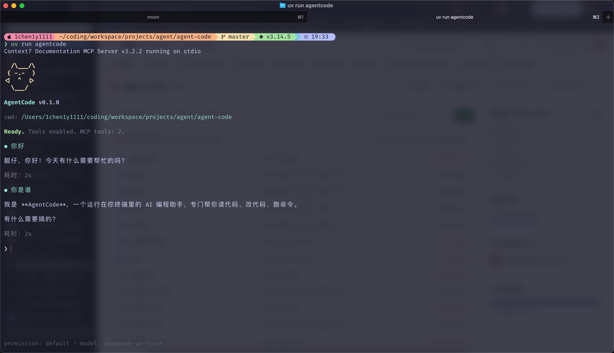
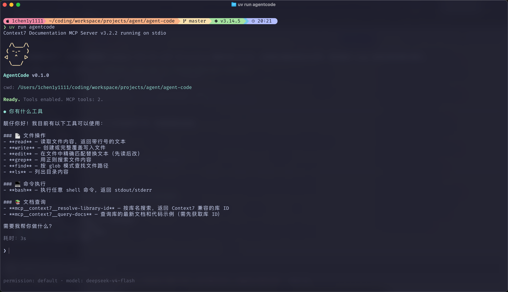
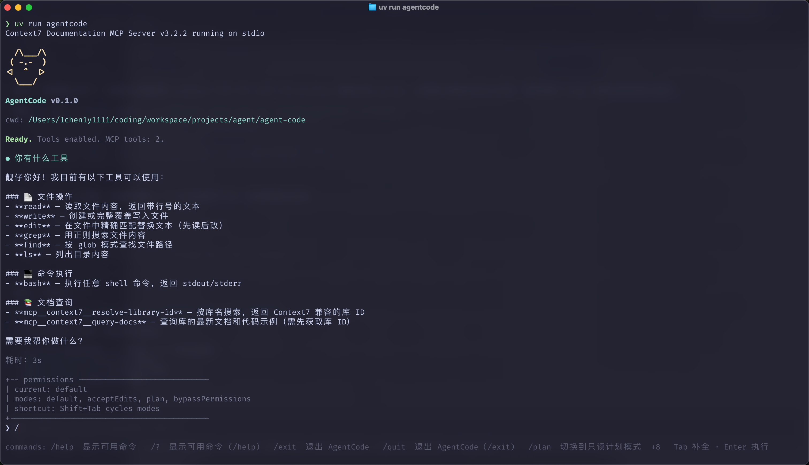
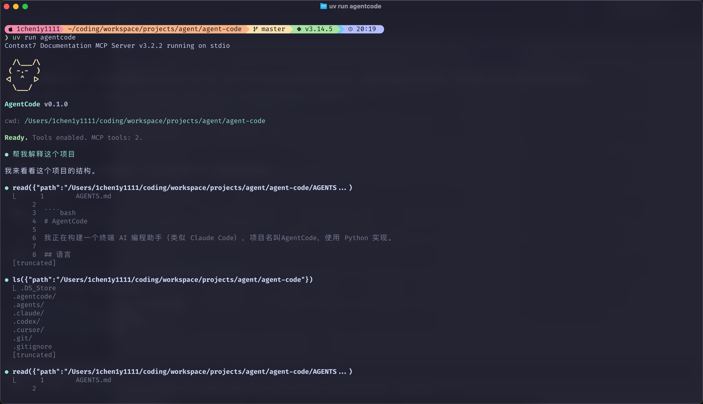
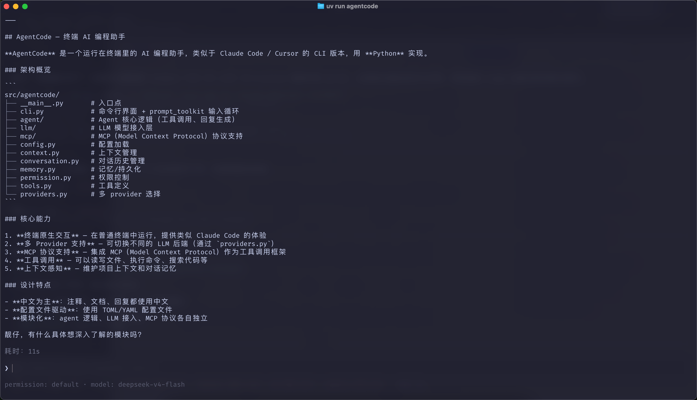

# AgentCode

AgentCode 是一个 Claude Code 风格的终端 AI 客户端。

当前交互界面是普通终端 CLI：输入由 `prompt_toolkit` 处理，模型回复和工具日志直接写入终端 scrollback。复制和滚动使用终端原生能力，不再进入全屏应用模式。

当前 provider 和 model 会显示在输入区底部状态栏，不会写入终端历史。

主输入行提交后会自动清掉，终端历史里只保留 AgentCode 渲染的用户消息和模型回复。

## 效果图

AgentCode 启动后会在普通终端中展示项目、工具和 MCP 状态，并在配置多个 provider 时先进入供应商选择。



完成选择后即可直接对话，底部状态栏会显示当前权限模式和模型。



AgentCode 支持文件读写、搜索、命令执行和 MCP 文档查询等工具能力，也可以通过 slash 命令快速查看可用操作。





它可以在对话过程中读取项目文件、列目录并基于真实上下文生成解释。





## 启动

```bash
uv run agentcode
```

也可以使用模块入口：

```bash
uv run python -m agentcode
```

## 配置

运行配置位于：

```text
.agentcode/config.yaml
```

该文件包含真实密钥，已被 `.gitignore` 忽略。先复制模板：

```bash
cp .agentcode/config.yaml.example .agentcode/config.yaml
```

配置格式：

```yaml
providers:
  - name: "Anthropic Claude"
    protocol: anthropic
    model: claude-sonnet-4-5-20250929
    base_url: https://api.anthropic.com
    api_key: replace-with-your-anthropic-api-key
    thinking: true

  - name: "OpenAI"
    protocol: openai
    model: gpt-4o
    base_url: https://api.openai.com/v1
    api_key: replace-with-your-openai-api-key
    thinking: false
```

如果只配置一个 provider，AgentCode 会直接进入对话；如果配置多个 provider，启动后会先打印编号列表让你选择。

对话中输入 `/exit` 或 `/quit` 退出。
